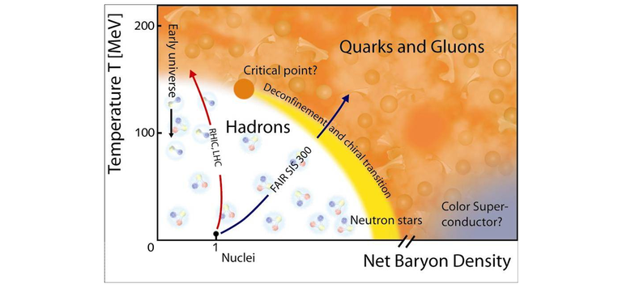

Source code for my jupiter notebooks on quark-hadron phase transitions.

Command on C9: 
jupyter notebook --ip=0.0.0.0 --port=8080 --no-browser

View online:

[MIT EOS with Vector interactions](http://nbviewer.jupyter.org/github/rsouza01/gribov_zwanziger/blob/master/src/notebooks/MIT_Vector.ipynb)

